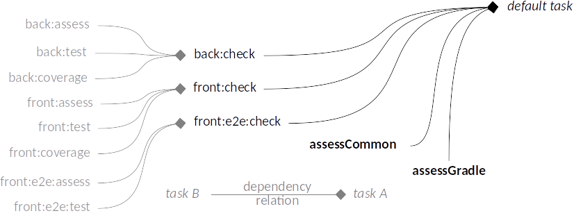

# Base code for a Web project - Java + JS

[](/LICENSE.txt)

**This project is build with the purpose of given a base code from where you can start to develop with a little of extra work.**

This project is licensed under the terms of the [MIT license](/LICENSE.txt).

## Goals

* The idea behind this is to have a base project where backend and frontend development are separated, in a way that each team, backend team and frontend team, can "focus" in their respective project "independently", but having the development tools integrated in order the facilitate all the process.
* Integrated in way that the developers only have to download the code and only need to have installed Java to start working (not need for installing Gradle[1], neither NodeJS[2]).
* Allowing hot changes in both frontend and backend.
* Independently but running on the same server[3].

Some things are Opinionated based on best practices and professional experience[4].

> [1] Using [Gradle Wrapper](https://docs.gradle.org/current/userguide/gradle_wrapper.html).  
> [2] Using [Gradle Node](https://github.com/srs/gradle-node-plugin).  
> [3] Another approach will be to have a server from frontend and another server for backend, but this will among other things require more resource from system and some projects can not afford that.  
> [4] Some topics in the README files have _References_ so you can dig more on details. And code has been "widely" commented to assist you to understand some fragments.  

## Features

* All in 1 project.
* Code Style Checking.
  * Project code (Java & Javascript).
  * Build code (Gradle).
* Test Driven Development.
  * Unit, Integration, End to end tests.
  * Code coverage checking.
* Code Documentation.
* Hot run.

### Using

* All in 1 project.
  * Backend: [Java](https://www.java.com) & [Spring Boot](https://spring.io).
  * Frontend: [Javascript](https://developer.mozilla.org/en-US/docs/Web/JavaScript), [NodeJS](https://nodejs.org) & [npm](https://www.npmjs.com/).
* Code Style Checking.
  * Java: [Checkstyle](http://checkstyle.sourceforge.net) & [PMD](https://pmd.github.io).
  * Javascript: [ESlint](https://eslint.org).
  * CSS: [StyleLint](https://github.com/stylelint/stylelint)
  * Gradle: [CodeNarc](http://codenarc.sourceforge.net).
* Test Driven Development.
  * Unit Test & Integration Test:
    * Java: [JUnit](http://junit.org) & [Mockito](http://javadoc.io/page/org.mockito/mockito-core/latest/org/mockito/Mockito.html).
    * Javascript: [Jasmine](https://jasmine.github.io) & [Karma](https://karma-runner.github.io).
  * End to end tests:
    * Javascript: [Selenium](http://www.seleniumhq.org).
  * Code coverage checking.
    * Java: [JaCoCo](http://www.eclemma.org/jacoco).
    * Javascript: [Istanbul](https://istanbul.js.org).
* Code Documentation.
  * Java: JavaDoc.
  * Javascript: [JSDoc](http://usejsdoc.org).
* Continuous build & Hot run: [Spring Dev Tools](https://docs.spring.io/spring-boot/docs/current/reference/html/using-boot-devtools.html) + [Gradle parallel task](https://guides.gradle.org/using-the-worker-api/)

## Prerequisites

* [Java](https://www.java.com/en/download/help/download_options.xml) (for running Gradle), which basically comes with every operating system, so this should not be a problem.
* [Chrome](https://www.google.com/chrome/browser/desktop/) and [Firefox](https://www.mozilla.org/en-US/firefox/) for End to End Test [1].
* [Git](https://git-scm.com/downloads) (only if the project is going to be cloned).

> [1] If only one of these is required or present, then configuration could be changed in order to use only what is required in [e2e project](front/e2e/README.md#Test-Driven-Development).

## Getting it

Clone or download the project[1], in the desired folder execute:

```sh
git clone https://github.com/gmullerb/basecode
```

> [1] [Cloning a repository](https://help.github.com/articles/cloning-a-repository/)

## Set up

+ **No need**, only download and run (It's Gradle! Yes!).

## Running it

* `gradlew`, will run default tasks:
  * [`:assessGradle`](#Gradle-Code).
  * [`:assessCommon`](#Code-Style-Checking).
  * [`:check`](#Gradle-Tasks-structure).

* `gradlew run`: will run the project.

* `gradlew tasks --all`: will get all the tasks for the project.

## Project structure

[Backend project](back/README.md) + [Frontend project](front/README.md) + [End to End Tests project](front/e2e/README.md)

## Folder structure

It's a gradle multi-project[1]:

- **Backend** project is located on `back/`.
  - It's a Spring Boot Project.
- **Frontend** project is located on `front/`.
  - It's a NodeJS Project.
- **End to End Tests** project is located on `front/e2e`.
  - It's a NodeJS Project.

Structure:

```
  /back
  /front
    /e2e
  /config
  /local_gradle
  /gradle
  /readme
```

* `back`: Backend project[2].
* `front`: Frontend project[2].
* `front/e2e`: End to End Tests project.
* `gradle`: Gradle Wrapper folder.
* `config`: Configuration files.
* `local_gradle`: Local gradle modules folder[3].
* `readme`: Readme attachments folder.

> [1] Remember to change the root project name in `settings.gradle`, even in single project builds: `rootProject.name = 'name'` to avoid Continuous Integration servers issues.  
> [2] Both, backend and frontend projects, try to have the same folder structure.  
> [3] "Heavy" gradle logic is extracted here.  

### Conventions

* `src/main`: Folder of Source code.
* `src/test`: Folder of Test code.
* Configuration folders will be named: `config`.
* Configuration files will be named ending with: `cfg.*`, `.yml`.
* Folder's name may use `_`, but not `-`.
* Files' name may use `-`, but not `_`.
* Throughout any documentation, `..` will represent an ellipsis to avoid possible confusion with `...` programming language operator.

### Recommendations

* In `/gradle/wrapper` the `gradle-wrapper.properties` file sets `gradle-#.#-all.zip` (this file allows access to gradle source), If this is no required, then change for `gradle-#.#-bin.zip` on `gradle-wrapper.properties` for a smaller JAR file for the wrapper.
* Don't use the _base_ or _absolute_ name on project's paths names.

## Gradle Tasks structure



Task ordering enforces to run quicker and lighter task before longer tasks when is possible.

Each task is has:

- First its own settings.
- Followed by base Gradle task  settings.

```groovy
task name (..) {
  // task settings
  ..
  // gradle task settings
  ..
}
```

`gradlew tasks`: Lists the runnable tasks for root project *basecode* (some of the listed tasks may belong to subprojects).

### Backend and Frontend Common Tasks

 [`local_gradle/code.gradle`](local_gradle/code.gradle) contains common gradle tasks definitions between Frontend and Backend in order to allow "same" set of task between both, e.g. `assess` which analyzes and assess code (Main & Test).

```
 code.gradle => CodeTask + CodeConfiguration
```

* CodeTask : Common Tasks names[1].
* CodeConfiguration: Common Tasks Configuration.

This way is easily to achieve any task in both projects.

`build.gradle` defines a default task with the purpose of doing all required checks that any developer of the project should run at least to ensure some degree of code wellness on any change before submitting the code: `assessGradle` + `:front:assessLocal` + `check`

> All tasks will generate console information and a report if possible.
> [1] Some are just alias, since real task name is too long or some plugin creates a task with different name (but same functionality), e.g.: `jacocoTestCoverageVerification`.  

## Configuration

In general, build.gradle files are structured in this way:

1. Buildscript dependencies.
2. Plugins.
3. Configurations.
4. Dependencies.
5. Constants.
6. Custom Tasks definition.
7. Plugin tasks configuration[1].

Project configurations are defined in[2]:

* [`build.gradle`](build.gradle).
* [`back.gradle`](back/back.gradle).
* [`front.gradle`](front/front.gradle).
* [`e2e.gradle`](front/e2e/e2e.gradle).

> [1] Usually plugin tasks depends on custom tasks.
> * If custom task depends on plugin tasks these are already defined on plugins.
>
> [2] Usually gradle files are all named `build.gradle`, but in order to avoid confusion each one has a a name that represents the respective project(this is all set in settings.gradle).

### Properties

Properties are defined in gradle.properties files. Properties are defined with prefixes in order to differentiate where is the origin and can be locate "quickly":

* `GLOBAL$property` -> [Main `gradle.properties`](gradle.properties).
  * Extra case for [`code.gradle`](local_gradle/code.gradle): `CODE$property` located in the [Main `gradle.properties`](gradle.properties).
  * When changing one of these constant special care have to be taken since it may affect tasks in the back, front and/or e2e project.
* `BACK$property` -> [Back `gradle.properties`](back/gradle.properties).
* `FRONT$property` -> [Front `gradle.properties`](front/gradle.properties).

### Repositories

* Remote: [jcenter](https://bintray.com/bintray/jcenter).
* Local: Maven local.

By default, the project use Remote repositories, but it could be changed to use local repository, for this execute: `gradlew .. -PlocalRepo`

### Running Environments

GLOBAL$DEFAULT_ENVIRONMENT is defined in the [`gradle.properties`](gradle.properties) file and sets the default environment (or profile) to `dev`[1].
It could be changed using command line: `gradlew bootRun -Penv=TARGET_ENVIRONMENT`.

> [1] Value should always be in lowercase.

### Highlights

* By default, Gradle daemon is disable, `org.gradle.daemon=false`, in the [`gradle.properties`](gradle.properties). (Some developers can not afford having daemon, They have hardware that don't have that much memory, this way memory is released after use).
* Gradle files are populate everywhere with different logging with different levels, use command line option `--debug` to get more information when running a task.
* Use `--debug-jvm` command line option for debugging.

#### Logging

Gradle is Superb! but when is about logging it has a good internal (not shared) Classes for this (with colors, etc., like classes derived from StyledTextOutput). Internal LocationAwareException exception some times can be really confusing, e.g. when it prints the line of a gradle file, at sometimes this line doesn't represents the real problem. A custom logger "overrides" the default logger for removing this from Gradle's logs. In [`logger.gradle`](local_gradle/logger.gradle) is where this is done:

```groovy
  project.gradle.useLogger(new BuildAdapter() { ...
```

* if log level is debug this is completely ignore.

### Recommendations

* Change versions: Most versions are set to the latest using `*` or `+`, so it can get the latest version the first time the project is started,  although is recommended to set it to fixed values later.
  * Test dependencies can remain dynamic since this will not affect production build, and allow to have latest improvements and fixes.
* This project was develop under Linux so, Windows user may (or may not) need to adjust some configuration values.

## Code Style

Code style will allow to follow the best practices and standard coding across team development.

### Code Style Checking

The idea is to catch errors before code is submitted by developers.

All projects have code style checking and have subsets of rules defined. Subsets try to be similar for all the code (Backend's, Frontend's and Build's code), in order to allow "almost" the same look and rules of the code:

* Rules are defined in [base-style-config project](https://github.com/gmullerb/base-style-config).

In the root project is defined a Checkstyle task, defined by [project-style-checker plugin](https://github.com/gmullerb/project-style-checker), that do some common checks for all files of the multi-project, `assessCommon`:

* Rules are defined in [base-style-config project](https://github.com/gmullerb/base-style-config).
* The only files that are not processed are `.gitignore` files (due to some internal excluding of the Checkstyle ant task).
* and It will ignore almost all patterns set in the `.gitignore` files, but patterns with ̣`!` and `[` + `]` will be bypassed (then avoid using these if possible).

#### Gradle Code

Gradle files (basically Groovy files) are checked with [CodeNarc](http://codenarc.sourceforge.net) using [project-style-checker plugin](https://github.com/gmullerb/project-style-checker). To highlights:

* Rules are defined in [base-style-config project](https://github.com/gmullerb/base-style-config).
* Report will be in `build/reports/codenarc`.
* `assessGradle` task is executed by default on the project.
* Version is defined with `GLOBAL$CODENARC_VERSION` on [`gradle.properties`](gradle.properties)


#### Convention over Configuration [1]

* Use `BASE_STYLE_CONFIG_VERSION` to establish the version of [Base Style Configuration](https://github.com/gmullerb/base-style-config) to be used, e.g. [`gradle.properties`](gradle.properties):

  * If not set, then last version will be used.

```gradle
 BASE_STYLE_CONFIG_VERSION=1.0.6
```

* Use `CHECKSTYLE_VERSION` to establish the version of [Checkstyle](http://checkstyle.sourceforge.net) to be used, e.g. [`gradle.properties`](gradle.properties):

  * If not set, Gradle's default version will be used.
    * At the present, should be set in order to be compatible with the set of rules defined by [Base Style Configuration](https://github.com/gmullerb/base-style-config)

```gradle
 CHECKSTYLE_VERSION=8.13
```

* *Use `CODENARC_VERSION` to establish the version of [CodeNarc](http://codenarc.sourceforge.net) to be used, e.g. [`gradle.properties`](gradle.properties):

  * If not set, Gradle's default version will be used.
    * At the present, should be set in order to be compatible with the set of rules defined by [Base Style Configuration](https://github.com/gmullerb/base-style-config)

```gradle
 CODENARC_VERSION=1.2
```

> [1] This is done by the [project-style-checker plugin](https://github.com/gmullerb/project-style-checker).

## Test Driven Development

* Both projects, back and front, have small tests to be used as a guide for real case test.
* Test are located in: `src/test`.
* Both projects have a `coverage` task in order to calculate code coverage.
* Code coverage is based on Unit Tests [1].
* End to end tests are defined in the [e2e project](front/e2e/README.md).
* All tdd tasks will generate console information and a file report with detail information.

> [1] Code coverage should be based only in coverage tests.

## Hot run

Use the `hotRun` task [1] to run the project and at the same time edit [2] Backend Java Code and Frontend JS code and the code will be reflected "immediately"[3].  This run will generate information that will be shown to console and into files.

For changing configuration go to ['hotrun.gradle'](back/local_gradle/hotrun.gradle):

* Tasks `concurrentClasses` and `concurrentBootRun`:
  * `showOutput`: Show the output for each run in console (`true` or `false`, default: `false`).
  * `showError`: Show error information for each run in console (`true` or `false`, default: `false`).
  * `outputFilePath`: If set, saves the output for each run in the specified file.
  * `errorFilePath`: If set, saves error information for each run in the specified file.
* Task `concurrentClasses`[4]:
  * `extraParams[0]`: Milliseconds between checking Code changes.
  * `extraParams[1]`: Show run number and time (`true` or `false`, default: `true`).

> [1] Based in [Gradle Daemons](https://docs.gradle.org/current/userguide/custom_tasks.html#worker_api).
> [2] If do it other way, it will possibly need 2 opened consoles for doing this.
> [3] Every 10s Code is check this can be change.
> [4] Both parameters must be set, even when requiring only one.

## Documentation

* Both projects, back and front, can generate documentation for their code.
* [`CHANGELOG.md`](CHANGELOG.md): add information of notable changes for each version here, chronologically ordered [1].

> [1] [Keep a Changelog](http://keepachangelog.com)

## Remember

* Start testing early.
* Code Review Everything => Encourage best practices and Team work.

## License

[MIT License](/LICENSE.txt)

## Additional words

I hope this will be the start for many amazing web projects.

Don't forget:

* **Love what you do**.
* **Learn everyday**.
* **Share your knowledge**.
* **Learn from the past, dream on the future, live and enjoy the present to the max!**.
