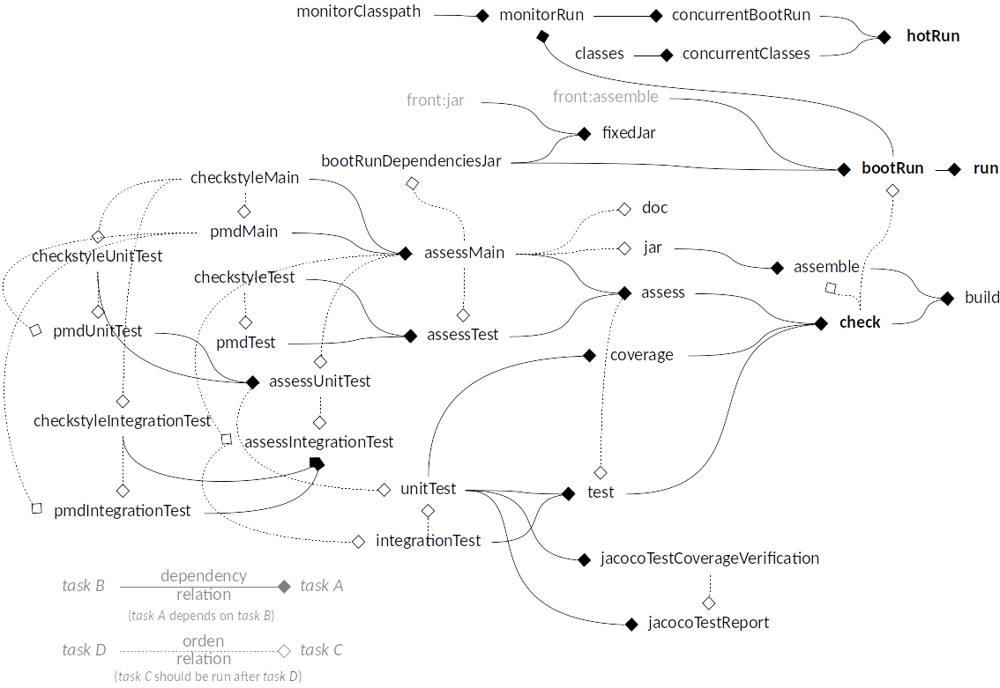

# Backend of the Web project - Java

## Folders structure

```
  /back
    /src
      /main
        /java
        /resources
      /test
        /java
        /resources
    /config
    /local_gradle
    /readme
```

- `src/main`: Source code.
- `src/test`: Test code.
- `config`: Configuration files.
- `local_gradle`: Local gradle modules folder.
- `readme`: Readme attachments folder.

* Backend is organized in package inside `src/main/java`.
* Backend environment information is in `src/*/resource/config/application-*.yml`.
  * With the current configuration, all environments information is inside the assembled Backend JAR.

### Conventions

* `*Test.java`: Unit test file
* `*IntegrationTest.java`: Integration test file

> Only use **Test** and **IntegrationTest** suffix for Test classes name, tests are processed based on this.

## Gradle Tasks structure



`gradlew :back:tasks`: Lists the runnable tasks for backend project.

### Running Environments

* [`application.yml`](src/main/resources/config/application.yml): Contains information common to any environment (values can be overridden independently by other files).
* [`application-test.yml`](src/test/resources/config/application-test.yml): Contains information for test environment.

`gradlew run -Dspring.profiles.active=selectedEnvironment`: will run the project in `selectedEnvironment`.

* e.g.: `gradlew run -Dspring.profiles.active=test` will run the project the environment defined in `application.yml` + `application-test.yml`.
* Go to the web browser look at the url: http://localhost:8080/

## Code Style

### Code Style Checking

Uses **Checkstyle** + **PMD**[1].

Checkstyle and PMD, in their different modalities, can be executed independently[2]:

* `gradlew checkstyleMain`
* `gradlew checkstyleUnitTest`
* `gradlew checkstyleIntegrationTest`
* `gradlew pmdMain`
* `gradlew pmdUnitTest`
* `gradlew pmdIntegrationTest`

Rules are defined in [base-style-config project](https://github.com/gmullerb/base-style-config).

> [1] PMD is run after Checkstyle, since Checkstyle is "lighter".  
> [2] The common parts between checks of Unit Tests and Integration Tests are done first, see `TEST_COMMON_SOURCE` in [`back.gradle`](back.gradle) (if not Checkstyle will fail to report some things due to the `checks_suppressions.xml` file)

## Test Driven Development

* Unit test are [JUnit](http://junit.org) test defined in `*Test.java` files.
* Integration test are [JUnit](http://junit.org) test defined in `*IntegrationTest.java` files.
* Environment for test can be set on the [`application-test.yml`](src/test/resources/config/application-test.yml)

> Only use **Test** and **IntegrationTest** suffix for Test classes name, tests are processed based on this.

## Hot run

[`Hot run`](../README.md#Hot-run)

## Documentation

Use `doc` task to generate Java documentation.
