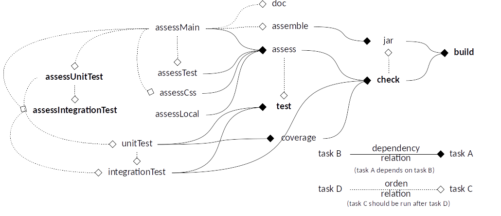

# Frontend of the Web project - JS

## Folders structure

```
  /src
    /main
    /test
  /config
  /local_js
  /local_modules
  /readme
```

* `src/main`: Source code.
* `src/test`: Test code.
* `config`: Configuration files.
* `local_js`: Local JS files required for Node Tasks.
* `local_modules`: Local Node JS modules.
* `readme`: Readme attachments folder.

* Frontend is organized in modules inside `src/main/modules`* Frontend environment information is in `src/*/config/environment-*.js`
  * With the current configuration, only the selected environment information is inside the assembled Frontend JAR.

### Conventions

* `*.test.js`: Unit test file
* `*.integration-test.js`: Integration test file

> Only use **.test.js** and **.integration-test.js** suffix for Test classes name, tests are processed based on this.

## Gradle Tasks structure



`gradlew :front:tasks`: Lists the runnable tasks for frontend project.

* :front:check
  * :front:assess
    * :front:assessMain
    * :front:assessTest
    * :front:assessCss
    * :front:assessLocal
  * :front:coverage

Frontend allows for underscore notation for npm tasks thanks to the plugin in use, e.g.:
`gradlew npm_version`: npm version
`gradlew :front:npm_update`: npm update

## Configuration

* Updating npm dependencies: `gradlew :front:npm_update`

### Running Environments

* [`environment.js`](src/main/config/environment.js): Contains information common to any environment (values can be overridden independently by other files).
* [`environment-dev.js`](src/main/config/environment-dev.js): Contains information for development environment.
* [`environment-qa.js`](src/main/config/environment-qa.js): Contains information for QA environment.
* [`environment-prod.js`](src/main/config/environment-prod.js): Contains information for production environment.
* [`environment-test.js`](src/test/config/environment-test.js): Contains information for test environment.
* Frontend jar will contain only information for the specified environment.

## Code Style

### Code Style Checking

Uses **[ESlint](https://eslint.org)** + **[StyleLint](https://github.com/stylelint/stylelint)**.

* **[ESlint](https://eslint.org)** rules are spread all over the `front` folder through `.eslintrc.json` files.
* **[StyleLint](https://github.com/stylelint/stylelint)** are defined in [`.stylelintrc.json`](.stylelintrc.json)
* The configuration is set in [`package.json`](package.json) file.

To highlights:

* Line length limit is ignored for lines with some patterns:
  * With URLs.
* Strings should use double quotes for strings [1].

To execute these tasks individually:
`gradlew assessMain`: ESLint checks
`gradlew assessUnitTest`: ESLint checks
`gradlew assessIntegrationTest`: ESLint checks
`gradlew assessCSS`: Stylelint checks
`gradlew assessLocal`: ESLint checks for Local JS Modules.

> [1] To be consistent with Backend code.

## Test Driven Development

* Unit tests are [Jasmine](https://jasmine.github.io) tests defined in `*.test.js` files.
  * Configuration is in [`unit-test.cfg.js`](config/test/unit-test.cfg.js).
  * Report from coverage can be look at `/build/reports/coverage/`.
    * This can be change with `COVERAGE_REPORT_DIR` in [`front.gradle`](front.gradle).
* Integration tests are [Jasmine](https://jasmine.github.io) tests defined in `*.integration-test.js` files.
  * Configuration is in [`integration-test.cfg.js`](config/test/integration/integration-test.cfg.js).
  * Loads [`environment.js`](src/main/config/environment.js), [`environment-test.js`](src/test/config/environment-test.js), `*.css` and `*.html`
* Both, unit tests and integration tests use [PhantomJS](http://phantomjs.org/).

## Documentation

Use `doc` task to generate [JSDoc](http://usejsdoc.org) documentation.
