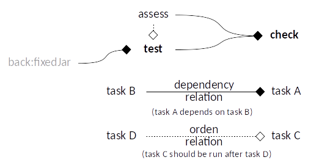

# End to End Tests for the Web project - JS

## Folders structure

```
  /src
    /test
  /local_js
  /readme
```

- `src/test`: Test code.
- `config`: Configuration files.
- `local_js`: Local JS files required for Node Tasks.
- `readme`: Readme attachments folder.

### Conventions

`*.e2e-test.js`: End to End test file

> Only use **.e2e-test.js** suffix for Test classes name, tests are processed based on this.

## Gradle Tasks structure



`gradlew :front:e2e:tasks`: Lists the runnable tasks for end to end test project.

## Code Style

### Code Style Checking

Uses **[ESlint](https://eslint.org)**.

* **[ESlint](https://eslint.org)** rules are spread all over the `e2e` folder through `.eslintrc.json` files.

To highlights:

* Line length limit is ignored for lines with some patterns:
  * With URLs.
* Strings should use double quotes for strings [1].

To execute this task
`gradlew assess`: ESLint checks
  This task will assess test code and configuration code.

> [1] To be consistent with Backend code.

## Test Driven Development

* End to end tests are [Jasmine](https://jasmine.github.io) + [Selenium](http://www.seleniumhq.org) tests defined in `e2e-test.js` files.
  * Configuration is in [`e2e.js`](local_js/e2e.js).
    * Browsers to use. default: [Chrome](https://www.google.com/chrome/browser/desktop/) and [Firefox](https://www.mozilla.org/en-US/firefox/) [1].
    ```javascript
      const BROWSERS = [Browser.CHROME, Browser.FIREFOX]
    ```
    * TIMEOUT_BROWSER: time out before test fails waiting for browser.
  * Tests will have available a variable `e2e` with:
    * `by`: [Selenium By](https://seleniumhq.github.io/selenium/docs/api/javascript/module/selenium-webdriver/index_exports_By.html) instance for locating an element on the page.
    * `browser`: [Selenium WebDriver](https://seleniumhq.github.io/selenium/docs/api/javascript/module/selenium-webdriver/index_exports_WebDriver.html) instance for test
    * `until`: Gets conditions for use with WebDriver wait.
  * Report can be look at `/build/report.html`.
    * This can be change with `--e2e_report_dir` in [`e2e.gradle`](e2e.gradle).

> [1] If only one of these is required or present, then configuration could be changed in order to use only what is required in [`e2e.js`](local_js/e2e.js) file and [`package.json`](../package.json) file.
